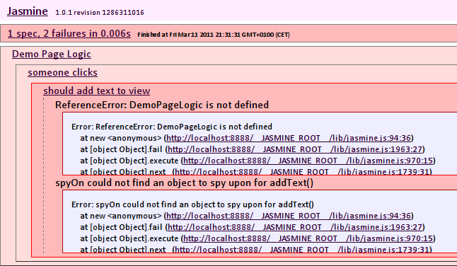
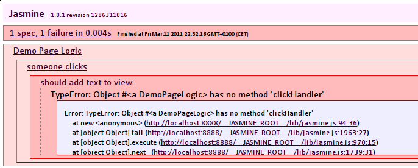
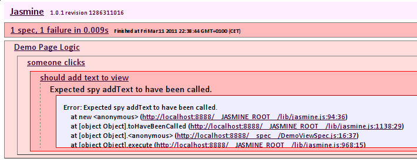
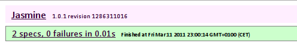
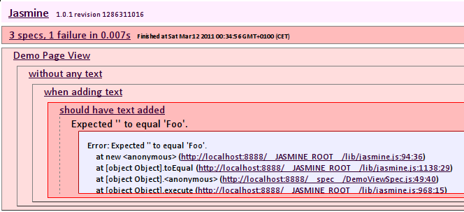

!SLIDE center 
#So, from the start ...

!SLIDE code

    @@@Javascript

    describe("Demo Page Logic", function() {

      describe('someone clicks', function() {

        var demoPageLogic;
        var demoPageView;

        beforeEach(function() {
          demoPageView = new DemoPageView();
          demoPageLogic = new DemoPageLogic(demoPageView);
        });

!SLIDE code

    @@@Javascript
        it('should add text to view', function() {
          spyOn(demoPageView, 'addText');
          demoPageLogic.clickHandler();
          expect(demoPageView.addText).toHaveBeenCalled();
        });
      });
    });

!SLIDE center

!SLIDE code

    @@@Javascript 
     
    function DemoPageLogic(demoPageView) {
    }

    function DemoPageView() {
    }

!SLIDE center

!SLIDE code

    @@@Javascript
    function DemoPageLogic(demoPageView) {
    }

    function DemoPageView() {
      this.addText = function() {
      };
    }

!SLIDE center

    
!SLIDE code

    @@@Javascript

    function DemoPageLogic(demoPageView) {
      this.clickHandler = function() {
      };
    }

    function DemoPageView() {
      this.addText = function() {
      };
    }

!SLIDE center

!SLIDE code

    @@@Javascript

    function DemoPageLogic(demoPageView) {
      this.clickHandler = function() {
        demoPageView.addText(); 
      };
    }

    function DemoPageView() {
      this.addText = function() {
      };
    }

!SLIDE center

!SLIDE code

    @@@Javascript

    it('should add addText as callback on init', function() {
      spyOn(demoPageView, 'addLinkClickedCallback');
      demoPageLogic.init();
      expect(demoPageView.addLinkClickedCallback)
        .toHaveBeenCalledWith(demoPageLogic.clickHandler);
    });

!SLIDE center

!SLIDE code

    @@@Javascript

    function DemoPageLogic(demoPageView) {
      this.clickHandler = function() {
        demoPageView.addText(); 
      };
    }

    function DemoPageView() {
      this.addText = function() {
      };

      this.addLinkClickedCallback = function(callback) {
      };
    }

!SLIDE center

!SLIDE code

    @@@Javascript

    function DemoPageLogic(demoPageView) {

      this.init = function() {
      };

      this.clickHandler = function() {
        demoPageView.addText(); 
      };
    }

    function DemoPageView() {
      this.addText = function() {
      };

      this.addLinkClickedCallback = function(callback) {
      };
    }

!SLIDE center

!SLIDE code

    @@@Javascript
    function DemoPageLogic(demoPageView) {

      this.init = function() {
        demoPageView.addLinkClickedCallback(this.clickHandler);
      };

      this.clickHandler = function() {
        demoPageView.addText(); 
      };
    }

    function DemoPageView() {
      this.addText = function() {
      };

      this.addLinkClickedCallback = function(callback) {
      };
    }

!SLIDE center

!SLIDE code

    @@@Javascript
    describe("Demo Page View", function() {

      var view;

      beforeEach(function() {
        view = new DemoPageView();
      });

      describe('without any text', function() {

        beforeEach(function() {
          $('body').append('

');
        });

!SLIDE code

    @@@Javascript

        describe('when adding text', function() {
          beforeEach(function() {
            view.addText();
          });

          it('should have text added', function() {
            expect($('#text_here').text()).toEqual('Foo');
          });
        });
      })
    });;

!SLIDE center

!SLIDE code

    @@@Javascript
    function DemoPageView() {
      this.addText = function() {
        $('#text_here').append('Foo');
      };

      this.addLinkClickedCallback = function(callback) {
        $('a').click(callback);
      };
    }

!SLIDE center

!SLIDE code

    @@@Javascript
    $(document).ready(function() {
        var demoPageView = new DemoPageView();
        var demoPageLogic = new DemoPageLogic(demoPageView);
        demoPageLogic.init();
    });
    
