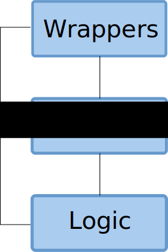

!SLIDE bullets

# Layers

* Should strive for MVC
* Problem with the DOM
  * View holds state
  * Should really be in model
* Logic - View it is

!SLIDE center
# Where We End Up

!SLIDE bullets

# A Slightly Less Dysfunctional Family

* Logic and View has shared custody of model
  * View is holds state in DOM
  * Logic handles ... logic
* Logic ends up micromanaging view

!SLIDE subsection

# What It Looks Like

!SLIDE code

    @@@Javascript
    
    function FooPageLogic(view) {
  
      this.init = function() {
        view.addFooChangedListener(this.showOrHideFoos); 
      };

      this.showOrHideFoos = function(e) {
        if (view.getSelectedFoo() == 'the_foo_were_looking_for') {
          view.showFoos();
        } else {
          view.hideFoos();
        }
      };
    }

!SLIDE code
  
    @@@Javascript
    $(document).ready(function() {
        var userPageView = new UserPageView();
        var userPageLogic = new UserPageLogic(userPageView);
        userPageLogic.init();
    });

